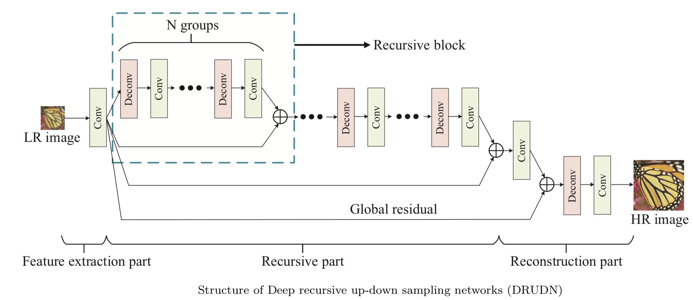
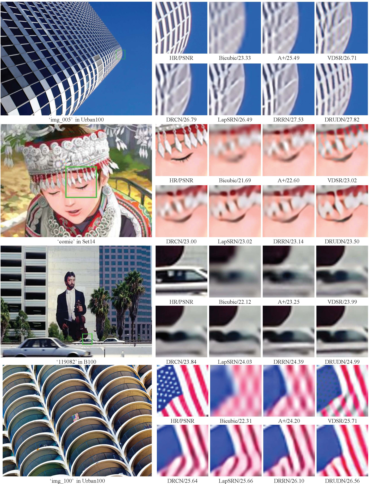
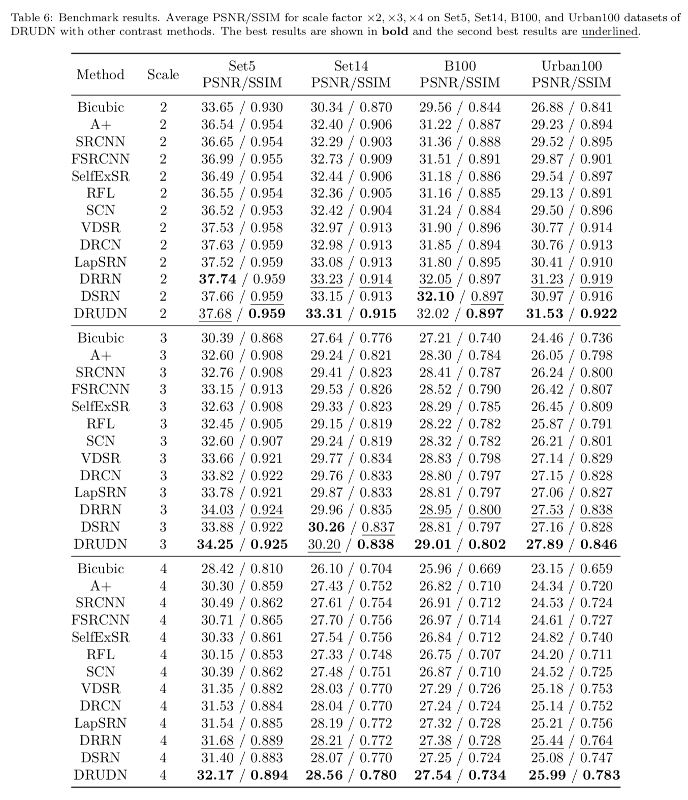

# Deep recursive up-down sampling networks for single image super-resolution
This repository is for DRUDN presented in the following paper


Z. Li, [Q. Li](https://liqilei.github.io/scholar/), W. Wu, et al., "Deep recursive up-down sampling networks for single image super-resolution", Neurocomputing, 2019 (Accepted). [[Link]](https://www.researchgate.net/publication/331353875_Deep_recursive_up-down_sampling_networks_for_single_image_super-resolution) 

The code is Inspired by [BasicSR](https://github.com/xinntao/BasicSR) and is tested on Ubuntu 16.04 environment (Python3.6, PyTorch_0.4.0, CUDA9.0, cuDNN5.1) with NVIDIA 1080Ti GPU.

## Contents
1. [Introduction](#introduction)
2. [Evaluate](#evaluate)
3. [Test](#test)
4. [Train](#train)
5. [Results](#results)
6. [Citation](#citation)
7. [Acknowledgements](#acknowledgements)

## Introduction
Single image super-resolution (SISR) technology can reconstruct a high-resolution (HR) image from the corresponding low-resolution (LR) image. In this paper, we propose the deep recursive up-down sampling networks (DRUDN) for SISR. In DRUDN, an original LR image is directly fed without extra interpolation. Then, we use the sophisticated recursive up- down sampling blocks (RUDB) to learn the complex mapping between the LR image and the HR image. At the reconstruction part, the feature map is up-scaled to the ideal size by a de-convolutional layer. Extensive experiments demonstrate that DRUDN outperforms the state-of-the-art methods in both subjective effects and objective evaluation.



## Evaluate
1. Prepare test data.
     Download test sets (e.g., Set5, other test sets are available from [GoogleDrive](https://drive.google.com/drive/folders/1xyiuTr6ga6ni-yfTP7kyPHRmfBakWovo?usp=sharing)) Run`eval/Prepare_TestData_HR_LR.m` in Matlab to generate HR/LR images with different scales. (i.e. 2, 3, 4).

2. Conduct image SR as [Test](#test). 
3. Run `eval/Evaluate_PSNR_SSIM.m` to obtain PSNR/SSIM values for paper.

## Test
1. Download models for our paper and place them in  `release` folder.
     We release 3 model for x2, x3, x4, respectively. These  can be downloaded from [Google Drive](https://drive.google.com/open?id=1Nq3IwQaY9w7TGP0ViSomK4ABbJ1xlsrT) and [Onedrive](https://stuscueducn-my.sharepoint.com/:u:/g/personal/qilei_li_stu_scu_edu_cn/EUz9rKxfZEBBqWFmpL9fSbsBaDzgJw21rE3MGdR1qun4BA?e=HitcHC).

2. Modify`options/test/test_drudn.json` to specify your own test options. Pay particular attention to the follow options:
   `scale` 	the up-scale between LR images and HR images. 
   `dataroot_HR` the path of HR dataset for train or validation
   `dataroot_LR`:  the path of HR dataset for train or validation
   **Pay particular attention**, the `scale` **must** match the `dataroot_LR`.

3. Cd to the root folder and run the follow command:
     `python test.py -opt options/test/test_drudn.json`

     Then, bomb, you can get the SR images in the `eval/SR/BI/DRRN` folder. 
## Train
### Prepare training data 

1. Download DIV2K training data (800 training images) from [DIV2K dataset](https://data.vision.ee.ethz.ch/cvl/DIV2K/) or [SNU_CVLab](https://cv.snu.ac.kr/research/EDSR/DIV2K.tar).

2. Modify and run `scripts/extract_subimgs.py` to crop the training data into patches. The default setting of the patches size is `480 * 480` and the stride is 240. After doing executing, a folder named `DIV2K_HR_sub` with 32202 patches can be obtained. 

3. Modify and run `scripts/generate_mod_LR_bic.m` to downsample the `DIV2K_HR_sub` into LR dataset. For `up-scale=2`, a folder named ` DIV2K_HR_sub_LRx2` with images sized of  `240 * 240` can be obtained. The same happens for  `up-scale=3` and `up-scale=4`. 

### Specify the train options 

4. Modify`options/train/train_drudn.json` to specify your own train options. Pay particular attention to the follow options:

   `scale` 	the up-scale between LR images and HR images. 
   `dataroot_HR` the path of HR dataset for train or validation
   `dataroot_LR`:  the path of HR dataset for train or validation

   **Pay particular attention**, the `up-scale` **must** match the `dataroot_LR`.

   More settings such as `n_workers`(threads), `batch_size` and other hy-parameters are set to default. You may modify them for your own sack. 

   <u>Some tips:</u>

   1. `exec_debug` option can let you debug your code freely. Since the huge train dataset and the deep network, debug becomes so difficult. Here, you can  set `exec_debug = true`, and the train data would be fed from the `dataroot_HR_debug` path and `dataroot_LR_debug`, in which you can put a small quantity of train data. (This do helps me a lot!). 
   2. `resume` option allows you to continue training your model even after the interruption. By setting set `resume = true`, the program will read the last saved check-point located in `resume_path`. 
   3. We set `'data_type':'npy_reset'` to speed up data reading during training. Since reading a numpy file is faster than reading an image file, we first transform PNG file to numpy file. This process is only performed once when the first time data is accessed.
### Begin to train 

5. After performing above modifications, you can start training process by runing `python train.py -opt options/train/train_DRUDN.json`. Then, you can get you model in `experiment/*****/epoch/best_epoch.pth`. You can also visualize the train loss and validation loss in `results/results.csv`. 

## Results

### Visual Results


### Quantitative Results


For more results, please refer to our [main papar](https://www.researchgate.net/publication/331353875_Deep_recursive_up-down_sampling_networks_for_single_image_super-resolution). 

## Citation

If you find the code helpful in your resarch or work, please cite our paper:

```
Z. Li, Q. Li, W. Wu, et al., Deep recursive up-down sampling networks for single image super-resolution, Neurocomputing, 2019 (Accepted). 
```

## Acknowledgements

This code is built on [BasicSR](https://github.com/xinntao/BasicSR) and [RCAN](https://github.com/yulunzhang/RCAN). We thank the authors for sharing their codes. 